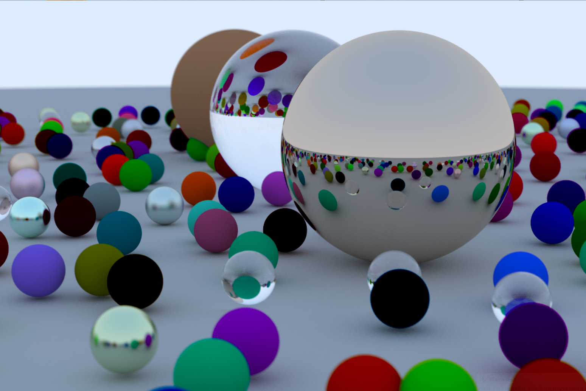

# Tracey McTracerFace

Tracey McTracerFace is a raytracer written in C, following the excellent Raytracing in a Weekend book. 

To create the final render as in the book, run `make prep && make release` followed by `bin/release/trmtrf > final-render.ppm`.

Known issue: spheres with negative radii don't quite work as they need to. 

